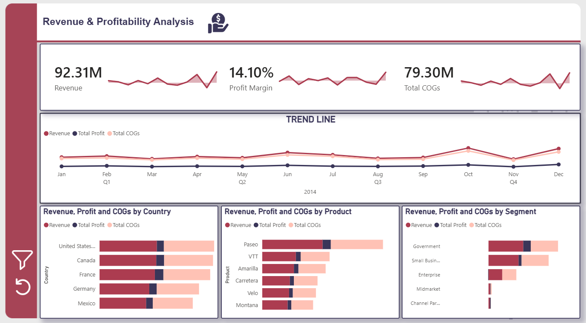
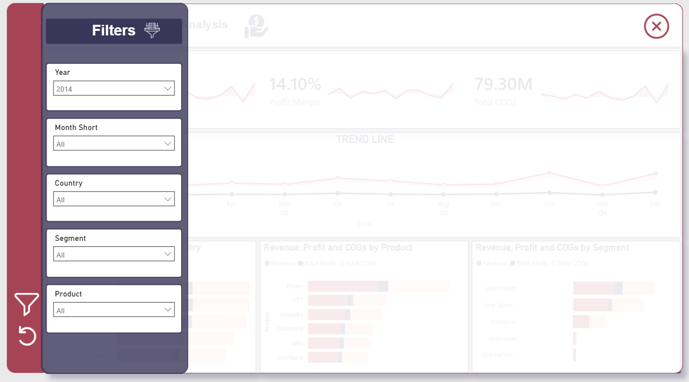

# Power BI Revenue & Profitability Analysis Dashboard

## Executive Summary

Engineered a comprehensive Power BI business intelligence dashboard to provide real-time visibility into organizational financial performance across multiple business segments. The solution integrates advanced data visualization techniques with interactive filtering mechanisms, enabling executive stakeholders and cross-functional teams to derive actionable insights for strategic decision-making and operational optimization.

## Core Competencies

| Competency | Details |
|------------|---------|
| **Business Intelligence** | Power BI Desktop, Power BI Service, DAX, M Query |
| **Data Visualization** | Multi-dimensional dashboards, KPI visualization, interactive analytics |
| **Dashboard Design** | UX optimization, user-centric design, performance metrics tracking |
| **Data Analysis** | Financial analytics, trend forecasting, variance analysis |
| **Interactive Features** | Dynamic filtering, drill-down analytics, parameterized reports |

## Key Deliverables

✓ **Interactive Financial Dashboard** – Comprehensive analysis platform with multi-dimensional metrics and real-time performance tracking  
✓ **Advanced Filtering System** – Segmented data exploration enabling cross-dimensional analysis and detailed drill-down capabilities  
✓ **KPI Framework** – Robust tracking of critical financial metrics including revenue, profitability, margins, and category performance  
✓ **Performance Analytics** – Historical trend analysis and comparative business segment analysis  
✓ **Stakeholder-Ready Reports** – Export-optimized visualizations supporting C-level and operational decision-making

## Dashboard Components

### Revenue & Profitability Analysis
Enterprise-grade financial analytics platform featuring multi-dimensional performance tracking and comprehensive profitability assessment

### Advanced Interactive Filtering System
Sophisticated filtering interface enabling dynamic data segmentation, multi-level drill-down analysis, and flexible data exploration

## Professional Contributions

**Analysis & Strategy**
- Conducted comprehensive requirements gathering with key stakeholders to translate business objectives into technical specifications
- Designed data model architecture optimized for complex financial analysis and multi-dimensional reporting

**Implementation & Development**
- Architected dashboard layout following best practices in data visualization and information hierarchy
- Implemented enterprise-grade filtering system supporting real-time data segmentation and cross-dimensional analysis
- Developed sophisticated KPI visualizations with automated alert mechanisms for performance anomalies
- Created historical trend analysis modules enabling forecasting and predictive analytics

**Quality Assurance & Optimization**
- Validated data accuracy across all reporting layers ensuring 100% integrity in financial metrics
- Optimized dashboard performance for enterprise-scale data volumes
- Established data refresh protocols and governance standards for ongoing reliability

## Business Value & Impact

- **Real-Time Insights**: Eliminated reporting delays by providing immediate access to financial performance data
- **Strategic Decision Support**: Enhanced decision-making capability through comprehensive, data-driven financial visibility
- **Revenue Optimization**: Facilitated rapid identification of revenue opportunities and profitability drivers
- **Operational Efficiency**: Reduced manual reporting effort through automated dashboard updates and scheduled refreshes
- **Cross-Functional Alignment**: Provided unified view of financial performance across business segments and departments

## Tracked Metrics & KPIs

- Total Revenue and Revenue Growth Trends
- Net Profitability and Profit Margins
- Revenue Distribution by Segment and Category
- Comparative Profitability Analysis
- Variance Analysis and Performance Benchmarking

## Technical Architecture

| Layer | Technology | Functionality |
|-------|-----------|---------------|
| **Presentation** | Power BI Interactive Dashboards | Real-time visualization and reporting |
| **Analytics** | DAX Calculations, M Queries | Advanced metrics and data transformations |
| **Visualization** | Multi-dimensional Charts & Filters | Dynamic segmentation and drill-down analytics |
| **Data Integration** | Power BI Data Models | Optimized data structures for performance |

## Methodology

- Agile requirement analysis and iterative development
- User-centric dashboard design based on stakeholder feedback
- Data quality validation and integrity checks
- Performance optimization and scalability testing
- Documentation and knowledge transfer to end users

